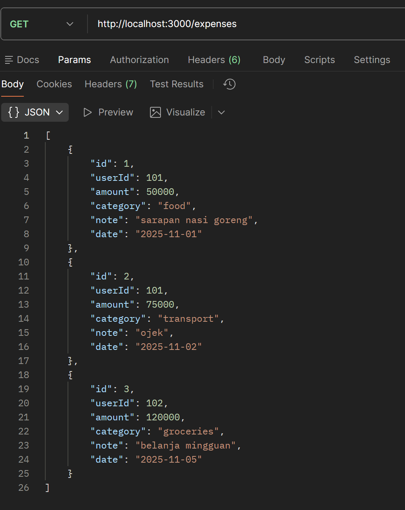
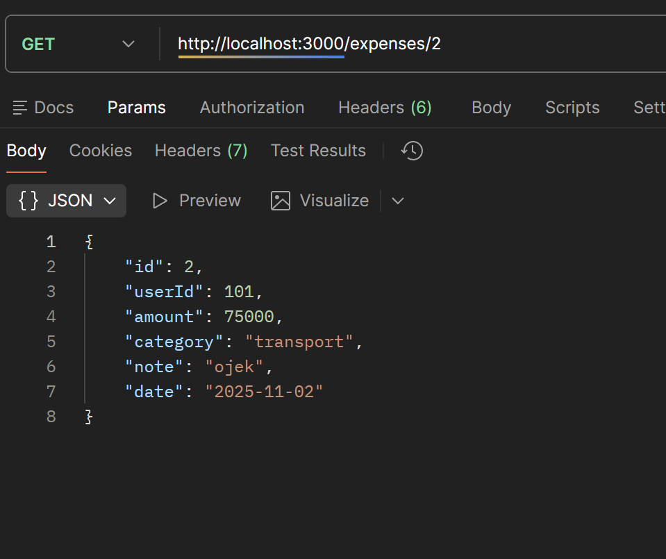
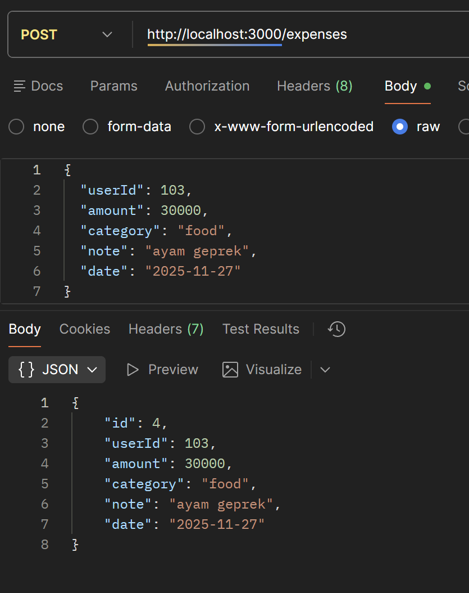
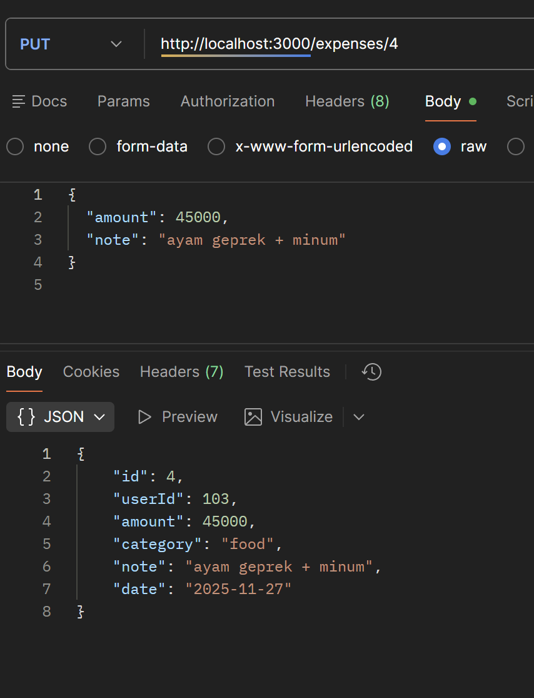
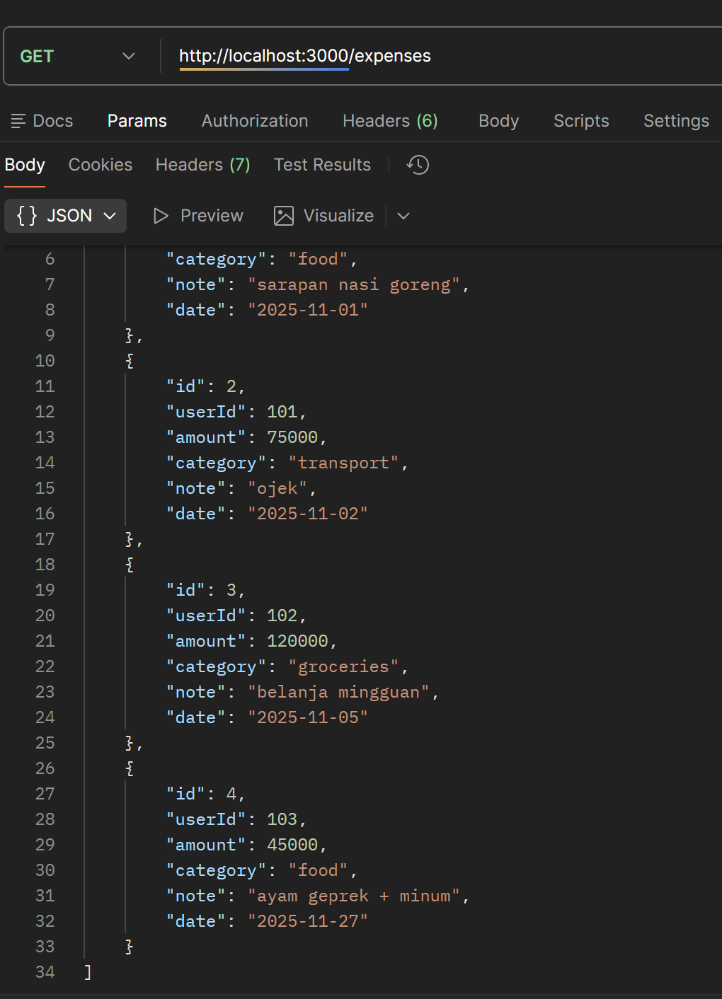
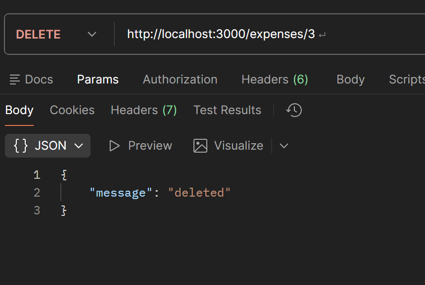
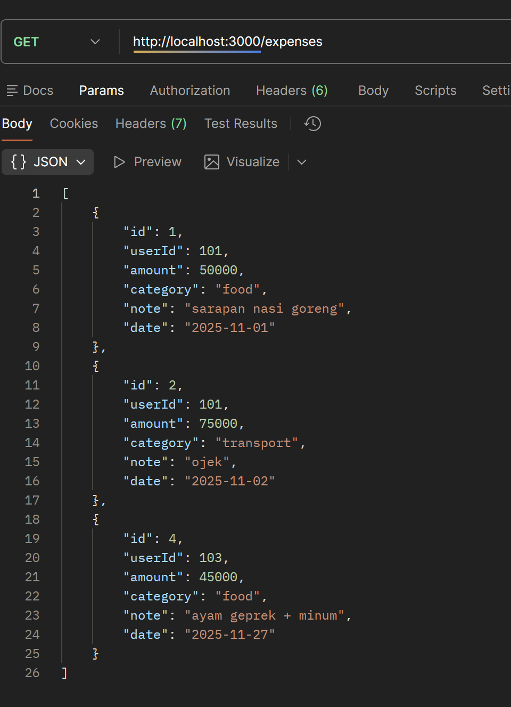
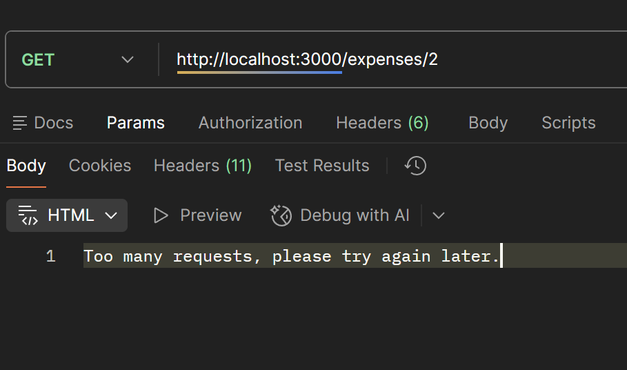
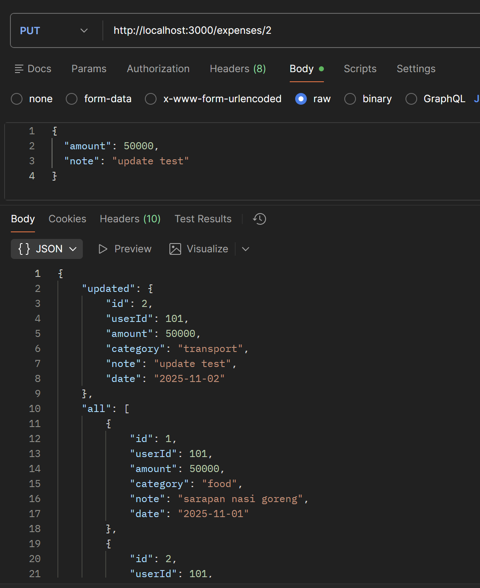
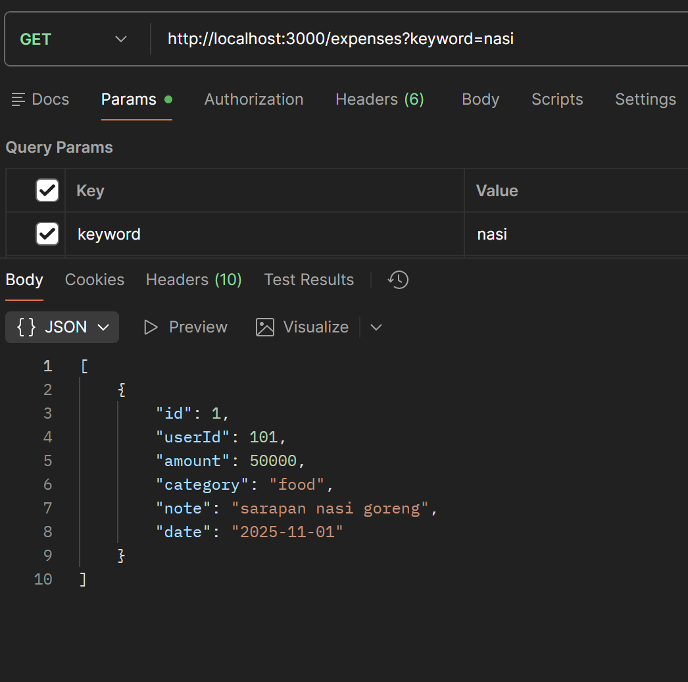

# Expense Tracker API

Aplikasi backend sederhana untuk mencatat pengeluaran pengguna. Dibangun dengan Node.js + Express dan dipisah modular (data, controllers, routes).

---

# 📌 1. Persiapan Project

## Install Dependencies
Jalankan perintah berikut di terminal:

```
npm install
```

---

# 📌 2. Start Server

Gunakan perintah berikut untuk menjalankan server:

```
npm start
```

Jika berhasil, terminal akan menampilkan:

```
Server running on port 3000
```

**Placeholder image:**


---

# 📌 3. Endpoints API


## **GET /expenses/:id**
Mengambil 1 item berdasarkan ID.


**Placeholder:**


---

## **POST /expenses**
Membuat data pengeluaran baru.

**Placeholder:**


---

## **PUT /expenses/:id**
Mengupdate data pengeluaran.

**Placeholder:**


---

## **GET /expenses**
Melihat semua data setelah PUT

**Placeholder:**


---

## **DELETE /expenses/:id**
Menghapus data.

**Placeholder:**


---

## **GET /expenses**
Melihat semua data setelah DELETE

**Placeholder:**


---

# 📌 4. Features

## **Keamanan Data**
Request secara rate limiter

**Placeholder**


---

## **PUT Seluruh Data**
Mengedit/menambahkan dengan seluruh data

**Placeholder**


---

## **Filter Mencari Data**
Filter data. Misal filter dengan keyword 'nasi'

**Placeholder**


---